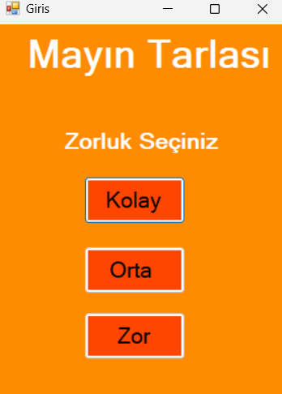
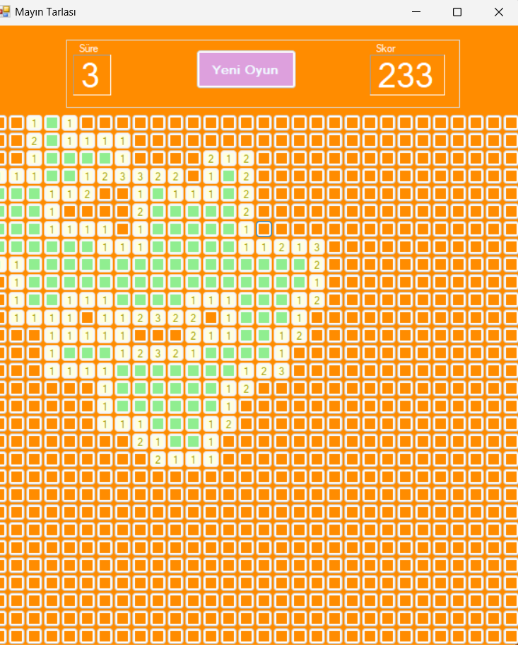

<h1>Mayın Tarlası</h1>

Bu proje de C# dili ile bir Mayın Tarlası oyunu yaptım.Bunu yaparken timer, button , textbox vb. windows form elemanlarını kullandım. </h2>

<h2>Oyunun Ana Menüsü</h2>

<h2>Oyunun Çalışır Hali</h2>

